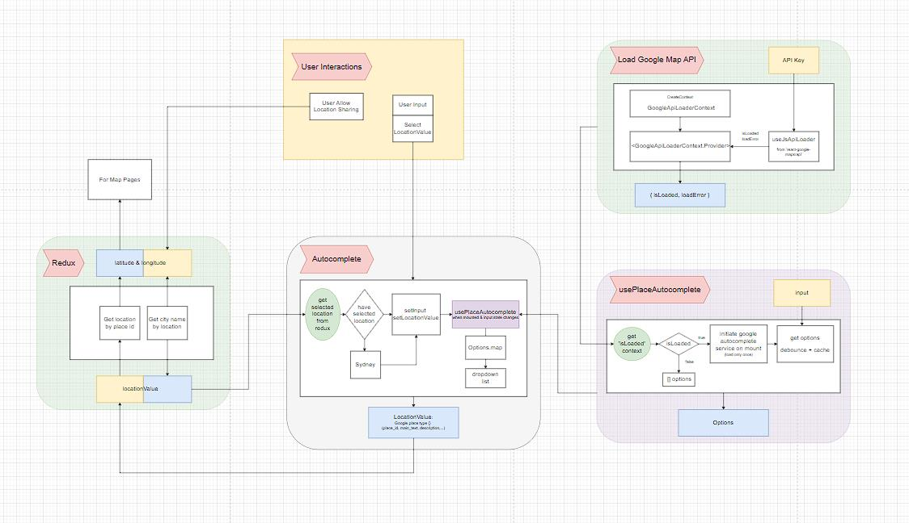

# Google Location Autocomplete Search
[LIVE DEMO](https://dianaleo.github.io/googleLocationSearch/)

## Tech stacks
- Syntax: Typescript + React
- Logic: React Hooks and Customized Hooks
- Storage: Redux + Context
- Styles: CSS + Customized MUI Components

## Logic Diagram

### User Interactions

Three user interaction events may occur:
- User changes input
- User select one option from dropdown menu options
- User click allow location sharing

The first two are autocomplete-component-related.

### Load Google Map API

To get the places predictions, Google Map API is applied. 
Before using its core functions, it needs to be loaded.

With vanilla Javascript, adding a `<script>` tag in the html header can solve the problem.
But a better way with React is using hooks. The package provides a hook `useJsApiLoader`. 
It takes an id, an API key, and an optional libraries prop, and returns an `{isLoaded, loadError}` object.
Then create a context, and put this object into the global context.

This project only contains one page, but there can be multiple pages using different Google Map service, one using Google Map, one using Google Places.
As long as `['places','maps']` is included, this `isLoaded` variable is accessible anywhere.

### usePlaceAutocomplete hook

The Google Places related logic is integrated into a **customized hook** `usePlaceAutocomplete`.
There is also a `use-places-autocomplete` package. But I prefer a customized one, to practice more.

This hook takes user input as the parameter, and returns location predictions, which is also dropdown menu options.
Within this hook, `isLoaded` is obtained from the global context first. On mounting, the package will be loaded, and it happens only once.
After the package is successfully loaded, `Google AutocompleteService` will be initiated.
And then this service provides a `getPredictions` function to return locaiton predictions.

The function calling is **debounced** with a 400ms delay. And the debounced function is cached with `useCallback`.

### Autocomplete and Redux

Regarding UI and controls, Autocomplete component is applied.
It has two states: `inputValue` and `locationValue`.
InputValue is what user input, and locationValue is what option user selected.

InputValue is just a string. It is for getting new location predictions as options. Options are then mapped to dropdown list items.

The initial value of these states are set with `searchLocation` slice from redux store. For a first-time user, there is no `searchLocation`, default value `Sydney` is applied.
If user chooses to allow location sharing, `searchLocation` becomes user current location. If user has chosen any place from the dropdown before he/she allow location sharing, then clicking allow will only set `userLocation` slice, `searchLocation` will be the same as what the user has chosen. 

Currently, when user select one option, locationValue is set to that option, and is set to redux store immediately. Inside redux slice, location type is converted from google.prediction to a customized type `LocationProp`, with latitude and longitude added. 

All the location data type converting jobs are processed within redux, where `getLocationById` and `getNameByLocation` functions are integrated here. In this way the Autocomplete component get neater and cleaner. 
